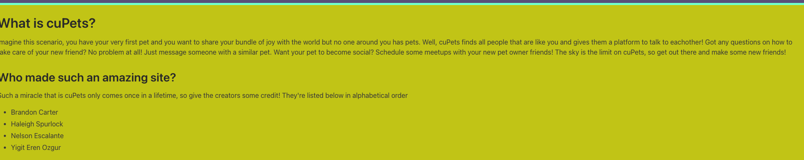
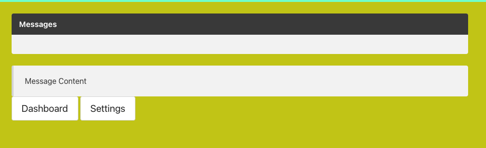

# **cuPets (“cuPets”)**

## Table of Contents

* [Description](#description)
* [Requirements](#requirements)
* [Installation](#installation)
* [Contributing](#contributing)
* [Credits](#credits)

## Description
---
Deployed Website: 






## Requirements 
---
```
Use Node.js and Express.js to create a RESTful API.
Use Handlebars.js as the template engine.
Use MySQL and the Sequelize ORM for the database.
Have both GET and POST routes for retrieving and adding new data.
Use at least one new library, package, or technology that we haven’t discussed.
Have a folder structure that meets the MVC paradigm.
Include authentication (express-session and cookies).
Protect API keys and sensitive information with environment variables.
Be deployed using Heroku (with data).
Have a polished UI.
Be responsive.
Be interactive (i.e., accept and respond to user input).
Meet good-quality coding standards (file structure, naming conventions, follows best practices for class/id naming conventions, indentation, quality comments, etc.).
Have a professional README (with unique name, description, technologies used, screenshot, and link to deployed application).

```

## Installation
---
No installation needed for this project

See deployed site here: https://ancient-dawn-51222.herokuapp.com/login

See repository here: https://github.com/Brandnn07/cuPets
## Contributing
---

Any and all improvement suggestions are welcome! 


## Credits
---
Brandon Carter (https://github.com/Brandnn07)

Eren Ozgur(https://github.com/erenozgur98)

Haleigh Spurlock (https://github.com/haleighspurlock)

Nelson Escalante (https://github.com/nescalante92) 

&COPY; 2021
